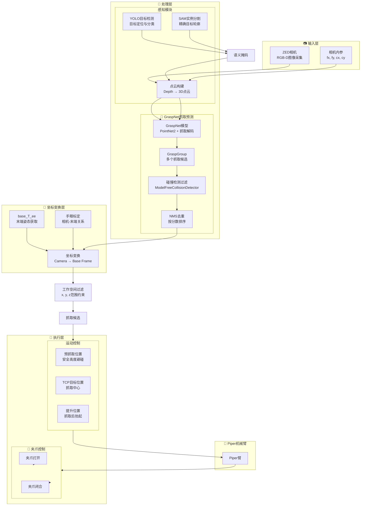
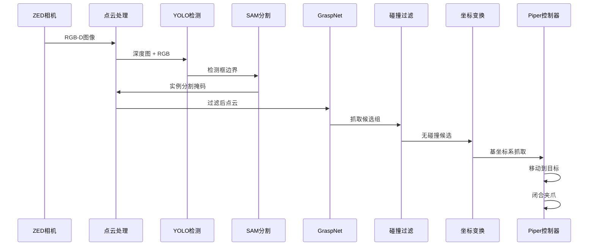
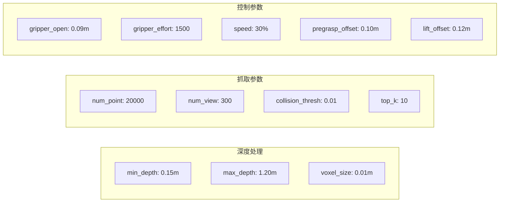
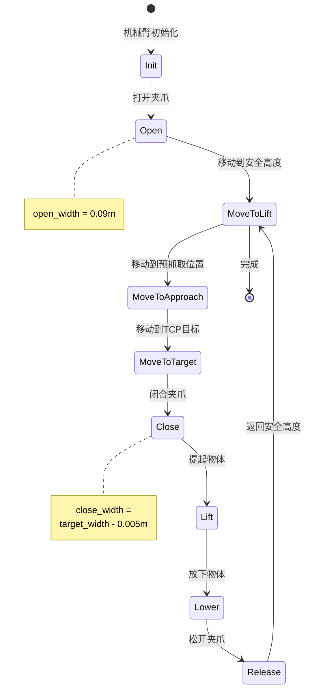
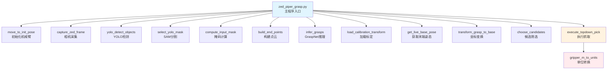

# GraspNet + ZED + Piper 抓取系统架构图

## 系统整体架构

```mermaid
flowchart TB
    subgraph Input["📷 输入层"]
        ZED["ZED相机<br/>RGB-D图像采集"]
        CameraParams["相机内参<br/>fx, fy, cx, cy"]
    end

    subgraph Processing["🧠 处理层"]
        subgraph Perception["感知模块"]
            YOLO["YOLO目标检测<br/>目标定位与分类"]
            SAM["SAM实例分割<br/>精确目标轮廓"]
            PointCloud["点云构建<br/>Depth → 3D点云"]
        end

        subgraph GraspNet["🤖 GraspNet抓取预测"]
            GraspNetModel["GraspNet模型<br/>PointNet2 + 抓取解码"]
            GraspGroup["GraspGroup<br/>多个抓取候选"]
            CollisionFilter["碰撞检测过滤<br/>ModelFreeCollisionDetector"]
            NMS["NMS去重<br/>按分数排序"]
        end
    end

    subgraph Coordinate["🔗 坐标变换层"]
        BaseTEE["base_T_ee<br/>末端姿态获取"]
        HandEyeCalib["手眼标定<br/>相机-末端关系"]
        CameraToBase["坐标变换<br/>Camera → Base Frame"]
    end

    subgraph Execution["🎯 执行层"]
        subgraph Motion["运动控制"]
            Pregrasp["预抓取位置<br/>安全高度避碰"]
            Target["TCP目标位置<br/>抓取中心"]
            Lift["提升位置<br/>抓取后抬起"]
        end

        subgraph Gripper["🤏 夹爪控制"]
            GripperOpen["夹爪打开"]
            GripperClose["夹爪闭合"]
        end
    end

    subgraph Robot["🤖 Piper机械臂"]
        PiperArm["Piper臂"]
        Gripper["夹爪末端执行器"]
    end

    ZED --> PointCloud
    PointCloud --> GraspNetModel
    YOLO --> Mask["语义掩码"]
    SAM --> Mask
    Mask --> PointCloud

    CameraParams --> PointCloud
    PointCloud --> GraspNetModel
    GraspNetModel --> GraspGroup
    GraspGroup --> CollisionFilter
    CollisionFilter --> NMS

    BaseTEE --> CameraToBase
    HandEyeCalib --> CameraToBase
    NMS --> CameraToBase

    CameraToBase --> Filter["工作空间过滤<br/>x, y, z范围约束"]
    Filter --> Candidates["抓取候选"]

    Candidates --> Motion
    Motion --> PiperArm
    GripperOpen --> Gripper
    GripperClose --> Gripper
    PiperArm --> Gripper
```

## 数据处理流程

```mermaid
sequenceDiagram
    participant ZED as ZED相机
    participant PC as 点云处理
    participant YOLO as YOLO检测
    participant SAM as SAM分割
    participant GN as GraspNet
    participant CF as 碰撞过滤
    participant CT as 坐标变换
    participant Piper as Piper控制器

    ZED->>PC: RGB-D图像
    PC->>YOLO: 深度图 + RGB
    YOLO->>SAM: 检测框边界
    SAM->>PC: 实例分割掩码
    PC->>GN: 过滤后点云
    GN->>CF: 抓取候选组
    CF->>CT: 无碰撞候选
    CT->>Piper: 基坐标系抓取
    Piper->>Piper: 移动到目标
    Piper->>Piper: 闭合夹爪
```

## 关键参数配置

```mermaid
graph LR
    subgraph DepthParams["深度处理"]
        D1["min_depth: 0.15m"]
        D2["max_depth: 1.20m"]
        D3["voxel_size: 0.01m"]
    end

    subgraph GraspParams["抓取参数"]
        G1["num_point: 20000"]
        G2["num_view: 300"]
        G3["collision_thresh: 0.01"]
        G4["top_k: 10"]
    end

    subgraph ControlParams["控制参数"]
        C1["gripper_open: 0.09m"]
        C2["gripper_effort: 1500"]
        C3["speed: 30%"]
        C4["pregrasp_offset: 0.10m"]
        C5["lift_offset: 0.12m"]
    end
```

## 夹爪控制时序

```mermaid
stateDiagram-v2
    [*] --> Init: 机械臂初始化
    Init --> Open: 打开夹爪
    Open --> MoveToLift: 移动到安全高度
    MoveToLift --> MoveToApproach: 移动到预抓取位置
    MoveToApproach --> MoveToTarget: 移动到TCP目标
    MoveToTarget --> Close: 闭合夹爪
    Close --> Lift: 提起物体
    Lift --> Lower: 放下物体
    Lower --> Release: 松开夹爪
    Release --> MoveToLift: 返回安全高度
    MoveToLift --> [*]: 完成

    note right of Close: close_width =<br/>target_width - 0.005m
    note right of Open: open_width = 0.09m
```

## 文件模块依赖

```mermaid
graph TD
    main["zed_piper_grasp.py<br/>主程序入口"]
    init["move_to_init_pose<br/>初始化机械臂"]
    capture["capture_zed_frame<br/>相机采集"]
    yolo["yolo_detect_objects<br/>YOLO检测"]
    sam["select_yolo_mask<br/>SAM分割"]
    mask["compute_input_mask<br/>掩码计算"]
    endpoints["build_end_points<br/>构建点云"]
    infer["infer_grasps<br/>GraspNet推理"]
    calib["load_calibration_transform<br/>加载标定"]
    basepose["get_live_base_pose<br/>获取末端姿态"]
    transform["transform_grasp_to_base<br/>坐标变换"]
    candidates["choose_candidates<br/>候选筛选"]
    execute["execute_topdown_pick<br/>执行抓取"]
    gripper_ctrl["gripper_m_to_units<br/>单位转换"]

    main --> init
    main --> capture
    main --> yolo
    main --> sam
    main --> mask
    main --> endpoints
    main --> infer
    main --> calib
    main --> basepose
    main --> transform
    main --> candidates
    main --> execute
    execute --> gripper_ctrl

    style main fill:#e1f5fe
    style execute fill:#fff3e0
    style gripper_ctrl fill:#ffebee
```

